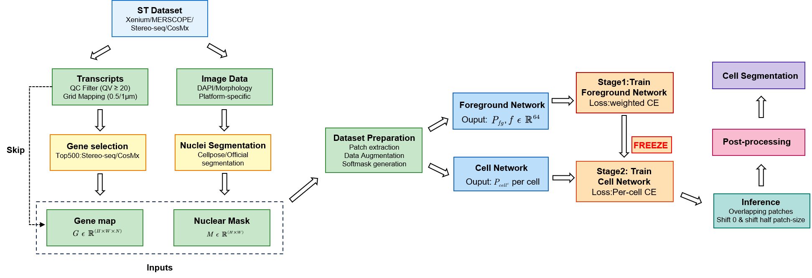
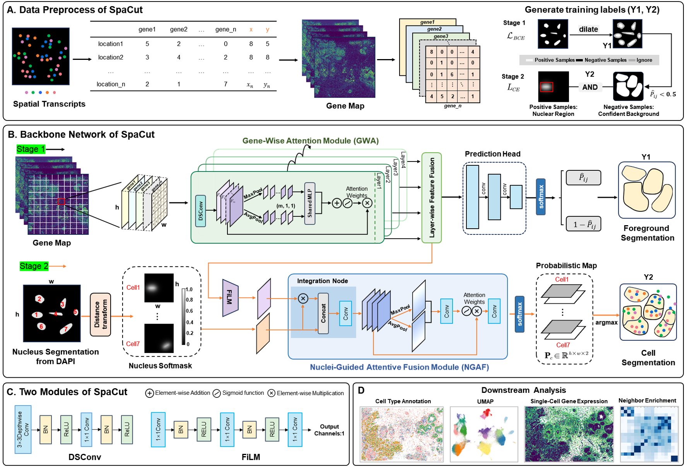

# SpaCut: Spatial transcriptomics-guided cell segmentation using deep learning

SpaCut is a deep learning framework for accurate cell segmentation in spatial transcriptomics data. It leverages both gene expression patterns and nuclear staining to achieve superior segmentation performance across multiple spatial transcriptomics platforms.

## Overview

### Workflow


SpaCut processes spatial transcriptomics data through a comprehensive pipeline:
- **Input**: Raw transcript data and DAPI/morphology images from various ST platforms (Xenium, MERSCOPE, Stereo-seq, CosMx)
- **Preprocessing**: Gene selection (top 500), nuclei segmentation (Cellpose), gene map generation
- **Training**: Two-stage training with foreground network and cell network
- **Output**: High-quality cell segmentation masks

### Model Architecture


SpaCut employs a dual-branch architecture:
- **Gene Feature Extractor**: Depthwise separable convolutions with channel attention for multi-channel gene expression
- **Foreground Branch**: Global context learning for foreground/background classification
- **Cell Prediction Branch**: Local refinement with spatial attention for precise cell boundary delineation
- **Multi-platform Support**: Works across Xenium, CosMx, MERSCOPE, Stereo-seq, and other platforms

## Installation

### Requirements
- NVIDIA GPU (tested on NVIDIA GeForce RTX 3090)
- Python 3.8+
- CUDA 11.8 (for PyTorch GPU support)

### Setup

1. Clone the repository:
```bash
git clone https://github.com/wenwenmin/SpaCut.git
cd SpaCut
```

2. Install dependencies:
```bash
pip install -r requirements.txt
```

**Note**: For PyTorch with CUDA support, you may need to install it separately:
```bash
pip install torch==2.0.1+cu118 --extra-index-url https://download.pytorch.org/whl/cu118
```

## Quick Start with Demo Data

We provide a demo dataset (Stereo-seq Mouse Brain) to help you get started quickly.

### Run the Demo

1. **Preprocess the data** (**Run demo_data.ipynb**):
   - The `demo_data/` folder contains preprocessed files
   - See `demo_data.ipynb` for the complete preprocessing pipeline
   - This notebook generates:
     - `demo_data/top500/top500_gene_map.tif` - Gene expression map
     - `demo_data/segmentation/nuclei_masks.tif` - Nuclear segmentation

2. **Run SpaCut on demo data**:
```bash
bash scripts/demo_stereo_seq.sh
```


 **Check results**:
   - Segmentation results will be saved in `demo_data/spacut_results/`
   - The main output is `segmentation_mask.tif`

## Prepare Your Own Data

SpaCut requires two inputs:
- **Gene expression map**: Multi-channel TIFF image where each channel represents a gene
- **Nuclear mask**: Segmented nuclei from DAPI/nuclear staining (can be generated using Cellpose)

### Data Preprocessing

#### For Stereo-seq Data:
See `demo_data.ipynb` for a complete example that demonstrates:
- Loading and exploring transcript data
- Selecting top 500 highly expressed genes
- Generating multi-channel gene expression maps
- Performing nuclear segmentation with Cellpose

#### For Xenium Data:
```bash
python preprocess/xenium.py \
--transcripts /path/to/transcripts.csv \
--cell_boundary_10X /path/to/cell_boundaries.parquet \
--nucleus_boundary_10X /path/to/nucleus_boundaries.parquet \
--out_dir ./data/xenium_output
```

#### For CosMx Data:
See `preprocess/Pancreas_CosMx.ipynb` for a complete preprocessing pipeline that:
- Extracts DAPI images from CellComposite files
- Generates gene expression maps from transcript data
- Performs nuclear segmentation with Cellpose/Cellpose-SAM

#### For MERSCOPE Data:
See scripts/Vigzen_MERSCOPE_Ovarian_Cancer3.sh

### Run SpaCut

```bash
python run.py \
--gene_map ./data/your_data/gene_map.tif \
--nuclei_mask ./data/your_data/nuclei_mask.tif \
--log_dir ./logs/your_experiment
```

## Dataset
All data used in this work are available at: https://zenodo.org/uploads/17547724.

## Output

SpaCut generates the following outputs in the specified `--log_dir`:
- segmentation_mask.tif
- Training logs and model checkpoints

## Project Structure

```
SpaCut/
├── src/
│   ├── dataset.py              # Dataset handling
│   ├── newmodel.py             # SpaCut model architecture
│   ├── newmodel_utils.py       # Model utilities
│   └── experiment_manager.py   # Experiment configuration
├── preprocess/
│   ├── xenium.py              # Xenium data preprocessing
│   ├── vizgen.py              # MERSCOPE data preprocessing
│   ├── Pancreas_CosMx.ipynb   # CosMx data preprocessing
│   └── check_paired.py        # Data quality verification
├── scripts/                   # Example shell scripts
│   ├── demo_stereo_seq.sh     # Demo 
│   ├── xenium_lung_cancer.sh
│   ├── CosMx_Human_Pancreas_fov51_top500.sh
│   └── Vigzen_MERSCOPE_Ovarian_Cancer3.sh
├── cellpose.ipynb             # Standard Cellpose segmentation examples
├── cellpose_sam.ipynb         # Cellpose-SAM segmentation examples
├── run.py                     # Main training script
```

## Supported Platforms

- **10X Genomics Xenium**: FFPE and fresh frozen samples
- **NanoString CosMx**: SMI spatial molecular imaging
- **Vizgen MERSCOPE**: MERFISH-based spatial transcriptomics
- **Stereo-seq**: High-resolution spatial transcriptomics
- Other platforms with transcript coordinates and nuclear staining


## License

This project is licensed under the MIT License - see the LICENSE file for details.

## Acknowledgments

Thanks the contributors of [UCS](https://github.com/YangLabHKUST/UCS) for their valuable resources and inspiration.